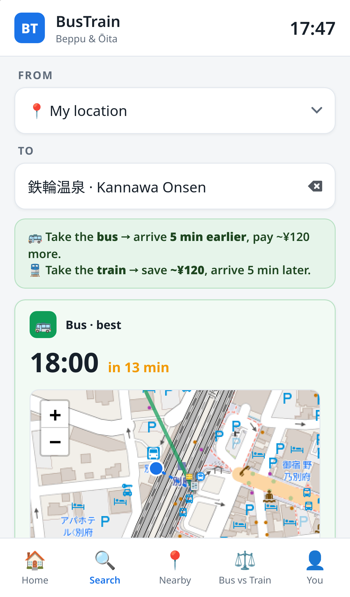
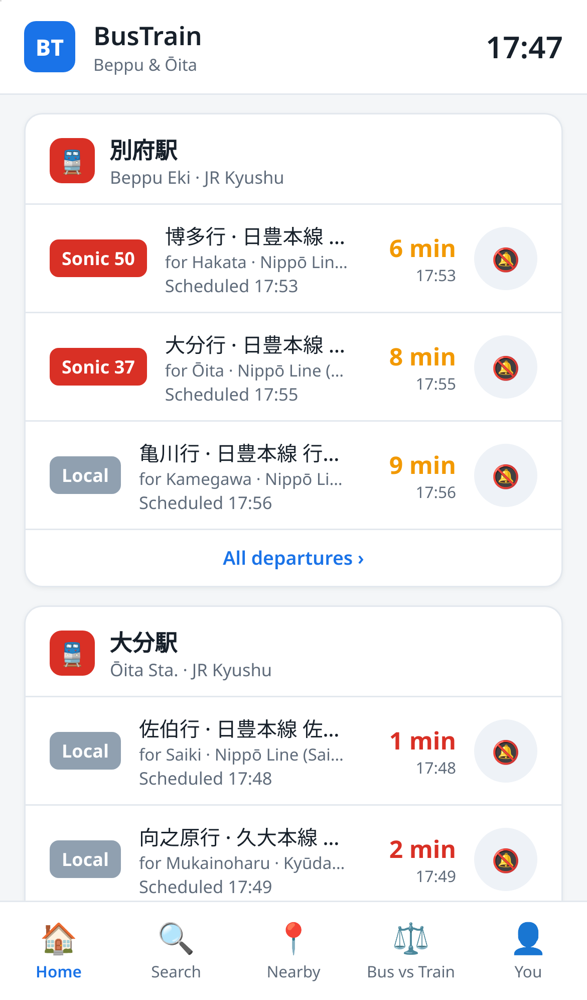

# 🚌🚆 BusTrain — never miss your bus or train

**A tourist-friendly bus & train departure app — Beppu/Ōita (Japan) and Jakarta
(Indonesia) editions, built to be adapted to any city with open transit data.**

Live demo: **https://bustrain.iameberhard.com** (install it from Safari/Chrome with
"Add to Home Screen" — it's a PWA) · **User guide:**
[bustrain.iameberhard.com/help.html](https://bustrain.iameberhard.com/help.html)

<p align="center">
  
  
</p>

## Why this exists

Transit apps assume you know the network. Tourists don't. In a foreign country you
don't know the stop names, you can't read the destination signs, you don't know
whether the bus or the train is the better choice, and you have no idea when to get
off. BusTrain answers exactly those questions:

- **Type the place, not the stop.** "Umi Jigoku", "airport", a restaurant, your
  hotel — 1,500+ local places from OpenStreetMap (sights, restaurants, cafés,
  hotels, hospitals) plus every station and stop, searchable in English or
  Japanese, with a worldwide web-geocoder fallback (Photon). You can even
  **paste a Google Maps share link** a friend sent you — the app resolves it to a
  destination. It then picks the right stop near you and near where you're going.
- **Bus vs train, honestly compared.** Next departure of each toward your
  destination, door-to-door: walking to the stop, riding, walking the last stretch.
  With real fares: *"Take the train → arrive 17 min earlier, pay ¥140 more. Take the
  bus → save ¥140, arrive 17 min later."*
- **Board with confidence.** The exact sign on the front of the vehicle
  (「大分駅前」 · Oita Eki Mae), a ✓ that it is scheduled to stop at your
  destination, and *"get off at the 24th stop, ~12:16"*.
- **A map of the first 500 meters.** You-are-here, the boarding stop, the get-off
  stop and the destination — zoomed to the walk you need right now (Leaflet + OSM).
- **Get-off alerts, two triggers.** A notification fires ~3 min before scheduled
  arrival *and* when GPS says you're within 400 m (bus) / 800 m (train) of your stop.
  Works without an account.
- **Real background notifications (Web Push).** Scheduled reminders are also
  delivered by the server — they arrive with the app closed and the screen locked,
  on Android, desktop, and iPhone (iOS 16.4+, installed to Home Screen).
- **Everything bilingual.** Kanji (to match signs on the street) + romaji/English
  side by side, from official translations where available and auto-romanized kana
  where not.
- **Departure boards & reminders** for pinned stops, full timetables per day type,
  and optional accounts that keep trip history plus running savings stats
  ("across 12 trips you saved ¥1,560 vs always taking the other option").
  No account → nothing is stored, by design.

## How it works

```
official data                build-time pipeline               static JSON        client
─────────────                ───────────────────               ───────────        ──────
GTFS-JP feeds (3 bus cos) ─▶ build_gtfs.py      ─▶ stops/*.json, patterns.json ─▶ vanilla JS PWA
JR station timetables     ─▶ fetch_jr.py        ─▶ jr stops + day types           (no framework)
train itinerary pages     ─▶ build_corridors.py ─▶ corridors.json (times/fares)
OpenStreetMap (Overpass)  ─▶ build_pois.py      ─▶ pois.json (landmarks)
GTFS translations.txt     ─▶ build_names_en.py  ─▶ names_en.json (romaji)
```

The clever bit is **`patterns.json`**: every bus trip is grouped into a route
pattern (ordered stop list + median minute offsets + a per-segment fare matrix from
the operators' fare tables). Each departure row carries its pattern id and stop
index, so the client can answer *"which upcoming departure near me passes within a
short walk of X, when does it get there, and what does it cost"* for **any**
origin/destination pair — offline-capable, no routing server. For the ~460 patterns
in this region that's 39 KB gzipped.

A small FastAPI server (`server/main.py`) serves the static app and provides
optional accounts (scrypt-hashed passwords, session cookies, SQLite) for trip
history. Everything else runs in the browser.

## Run it yourself

```bash
git clone https://github.com/eberhard0/bustrain && cd bustrain
pip install -r requirements.txt

# build the data (Beppu/Ōita edition; ~10 min, polite 1 req/s scraping)
python3 pipeline/build_gtfs.py        # downloads nothing: put GTFS zips in data/raw/ first — see below
python3 pipeline/fetch_jr.py          # JR station timetables (cached)
python3 pipeline/build_names_en.py    # romaji dictionary
python3 pipeline/build_corridors.py   # bus-vs-train station-pair times & fares
python3 pipeline/build_pois.py        # OSM landmarks

# serve
cd server && uvicorn main:app --port 3021
# open http://127.0.0.1:3021
```

GTFS input: download the three Ōita feeds from the [Ōita open-data catalog
(BODIK)](https://data.bodik.jp/) — datasets `大分バスGTFSデータ`, `大分交通GTFSデータ`,
`亀の井バスGTFSデータ` — and unzip them into `data/raw/oitabus/`, `data/raw/oitakotsu/`,
`data/raw/kamenoibus/`.

## Cities

| City | Data | Modes |
|---|---|---|
| Beppu & Ōita, Japan | Ōita Pref. GTFS-JP ×3 + JR Kyushu timetables | bus + train, ¥ |
| Jakarta, Indonesia | TransJakarta GTFS (frequency-based) | bus, Rp |

The app auto-selects the city from your phone's timezone on first visit; tap the
city name in the header to switch. Each city lives in `web/data/<city>/` and is
declared in `web/data/cities.json` (timezone, currency, has-rail flag).

## Adapting BusTrain to your city / country

This codebase was written to generalize. What's regional and what's not:

| Component | Regional? | What to do for a new region |
|---|---|---|
| `gtfs_core.py` (used by `build_gtfs.py` / `build_jakarta.py`) | **No** — standard GTFS, incl. `frequencies.txt` headway feeds | Point it at any GTFS feed(s): [Mobility Database](https://mobilitydatabase.org/) lists thousands worldwide. Update the `FEEDS` dict (names/colors) and the pattern-id prefixes. Fares work if the feed has `fare_rules.txt`. |
| `patterns.json` routing | **No** | Works unchanged for any GTFS region. |
| `fetch_jr.py` | **Yes** — scrapes JR Kyushu | If your rail operator publishes GTFS, delete this and treat rail as another GTFS feed (set `kind: "train"`). Otherwise write an equivalent scraper/importer for your operator's published timetables. |
| `build_corridors.py` | Partially | Only needed for the bus-vs-train comparison between named station areas. With all-GTFS input you can compute rail times from GTFS instead of itinerary scraping. The fare ladder is JR-specific — replace with your operator's. |
| `build_pois.py` | **No** — OSM is global | Change the bounding boxes in the Overpass query. Add your own `MANUAL` must-have landmarks. |
| `build_names_en.py` | Japan-specific | The kana→Hepburn romanizer and JR name table are Japanese. For non-Latin-script countries, swap in your own transliteration; for Latin-script countries you may not need this layer at all. |
| Japanese holidays | `fetch_jr.py` hardcodes 2026–27 | Replace with your country's holiday calendar (day-type resolution). |
| Web app (`web/`) | **No** | UI strings are English; stop names render whatever the data contains. The `LINES` arrays in `trips.js` (rail-line station order) and `ALIAS` romaji shortcuts are the only Japan-specific bits. |
| Timezone | `Asia/Tokyo` in `app.js` (`jstNow`) | One constant to change. |

Rough effort for a new GTFS-covered city: **a weekend**. Most of it is curating
landmarks and checking the feed's quirks (day-type calendars vary wildly).

## Deployment notes

- Any static host + small Python host works. The reference deployment is
  `uvicorn` behind a Cloudflare Tunnel, managed by a systemd user unit.
- `scripts/release.sh <n>` stamps asset versions (`app.js?v=n`) — necessary because
  CDNs (Cloudflare default) cache `.js`/`.css` aggressively; versioned URLs make
  every deploy reach clients immediately, and the service worker auto-reloads open
  tabs once.
- `ops/qa/qa_full.py` is a Playwright harness that captures every view on desktop
  Chromium and an emulated iPhone (WebKit) — run it after changes.

## Enabling notifications on iPhone (for users)

Apple only allows web-app notifications for apps installed to the Home Screen
(iOS 16.4+). One-time setup:

1. Open the site in **Safari** and tap the **Share** button (square with an arrow).
2. Scroll down, tap **Add to Home Screen**, then **Add**.
3. Open **BusTrain from the new icon** — not from Safari.
4. Set any reminder and tap **Allow** when iOS asks about notifications.

After that, departure and get-off reminders arrive like any app's notifications —
app closed, screen locked. (The app shows this walkthrough automatically to
Safari-on-iPhone visitors.) If you previously tapped "Don't Allow": Settings →
Notifications → BusTrain → Allow Notifications.

To run push on your own deployment: `pip install pywebpush`, then generate keys
once — see `server/main.py` (`vapid_private.pem` / `vapid_public.txt`, both
gitignored). Without keys the app quietly falls back to open-app reminders.

## Honest limitations

- **Scheduled times only.** The open data has no realtime vehicle positions, so
  delays are invisible. Treat tight connections accordingly.
- **GPS get-off alerts need the app on screen during the ride** (browser geolocation
  stops in background). The scheduled-time alert covers the closed-app case via push.
- **JR fares are approximate** (distance-ladder estimate, marked with "~"). Bus
  fares are exact where the GTFS fare tables cover the hop, and the app says so
  when they don't.
- **Timetables change** (JR revises each March; bus feeds roll annually). Re-run
  the pipeline; the app shows its data build date in the footer.

## Data sources & attribution

- Bus schedules & fares: Ōita Prefecture open data — Ōita Bus, Ōita Kōtsū and
  Kamenoi Bus GTFS-JP feeds via [BODIK](https://data.bodik.jp/) (CC BY 4.0).
- Train times: compiled from [JR Kyushu's published station
  timetables](https://www.jrkyushu-timetable.jp/) at build time. Generated
  timetable data is **not redistributed** in this repository — you build it
  yourself from the source.
- Landmarks & map data: © [OpenStreetMap](https://www.openstreetmap.org/copyright)
  contributors (ODbL); tiles from openstreetmap.org.
- Map library: [Leaflet](https://leafletjs.com/) (BSD-2-Clause), vendored.

## Roadmap

- GTFS-Realtime ingestion where available
- GPS get-off alerts that survive backgrounding (needs a native wrapper)
- More regions — the pipeline is the product; Beppu/Ōita is edition #1

## License

MIT — see [LICENSE](LICENSE). Not affiliated with any transit operator.
Timetables can change without notice; always allow a margin for important trips.
